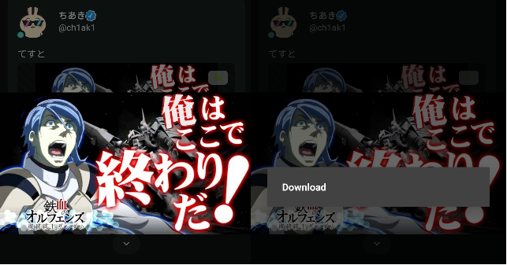
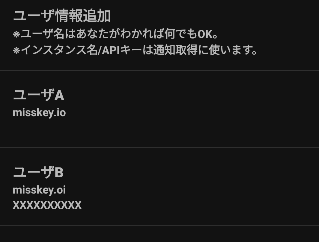
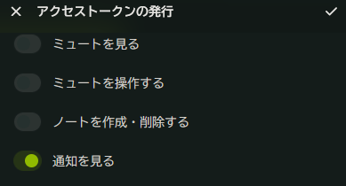

## Q&A  

### 画像の保存ってどうやるの？

画像を表示したら、画像を長押しするとDownloadダイアログ出ます。

Downloadを押下すると画像をダウンロード出来ます。

### 設定画面内のインスタンス/API登録って何？
ユーザ、インスタンス名、APIキーを登録する機能です。

登録することで、Flosskey上で開くデフォルトのインスタンスを切り替えたり、APIキーを使用して通知を受け取ることができます。  

尚、APIキーの登録は必ずしも必要ではありません。ユーザとインスタンスだけ登録することも可能です。
　
- ユーザ名
-> 登録した情報を他の情報と区別するために用意しています。  
-> そのため、区別さえつけばどんな文字列でも動作に支障はありません。
- インスタンス名  
-> 普段使用するインスタンス名を登録します。  
-> 登録したインスタンスはサイドバーの「登録済みインスタンス」に追加されます。  
-> 登録したインスタンスをタップすることでそのインスタンスに切り替えることができます。 
- APIキー  
-> misskeyから発行されたAPIを入力することで、misskeyから通知を受け取ります。  
-> APIキーは一緒に登録したインスタンスから発行されたものでないと使えません。  

以下は実際の登録例です。

備考：
- インスタンス名は「https://」不要です。
- ご安心を。APIキーはkeystoreで端末内に安全に保持されます。

### APIキーの取得方法を教えてください
APIキーはmisskeyの「設定」->「API」->「アクセストークンの発行」から発行できます。  

権限は「通知を見る」のみにチェックを入れてください。  

APIキーを取得したらAPIキーの入力欄に入力して有効となります。

### 入力したAPIキーが正しいか不安なんだが
APIキーを入力したらそれが正しいAPIか簡単に判定する処理の実装を予定してます。

### 通知の間隔って制御できないの？間隔を短くしたい
本アプリではPlayServiceを使わずJobServiceという技術を使って通知処理を実装しています。  

そのため。15分より短い間隔で通知を取りに行くことは出来ません。  

アプリをForegroundにして短い間隔でも取りに行けるようにする実装なども考えておりますが、今のところ優先度は低いです。  

逆に、通知間隔を長めに設定することは可能です。こちらは今後対応予定です。

### API登録したらいきなり数十件通知来たんだけど！
仕様です。API登録時は取れる通知をたくさん取ってきます。

その後はFlosskeyが通知していない新しい通知だけ　を取得するようになります。

### misskey本家のPWAとどう違うの？
現状のFlosskeyとPWAとの差別点は下記です。
- 戻るボタンで終了を防ぐ機能がある。
- PlayServiceが無い・ブラウザがPWA対応していない端末でも通知を受け取れる。
- 複数インスタンスに対応している。
- misskeyドメイン以外のwebページへの遷移をアプリ外で行う。
- 端末のホーム画面にアプリを置かなくてもいい(苦笑)。

### 不具合を発見したがどうすれば？
下記の内好きな方法で不具合を開発者に教えてください。喜びます。  
- [開発者](https://misskey.io/@ch1ak1)にmisskey上で直接やりとりする
- githubでissue建てる
- #Flosseky タグをつけて投稿

※Fediverseなのでタグをつけて投稿はちょっと弱いかもしれない。

### 追加して欲しい機能がある。
[開発者](https://misskey.io/@ch1ak1)に直接お願いします。

大丈夫だよ、[開発者](https://misskey.io/@ch1ak1)は友達がいないから気軽に話しかけても迷惑にならないよ
